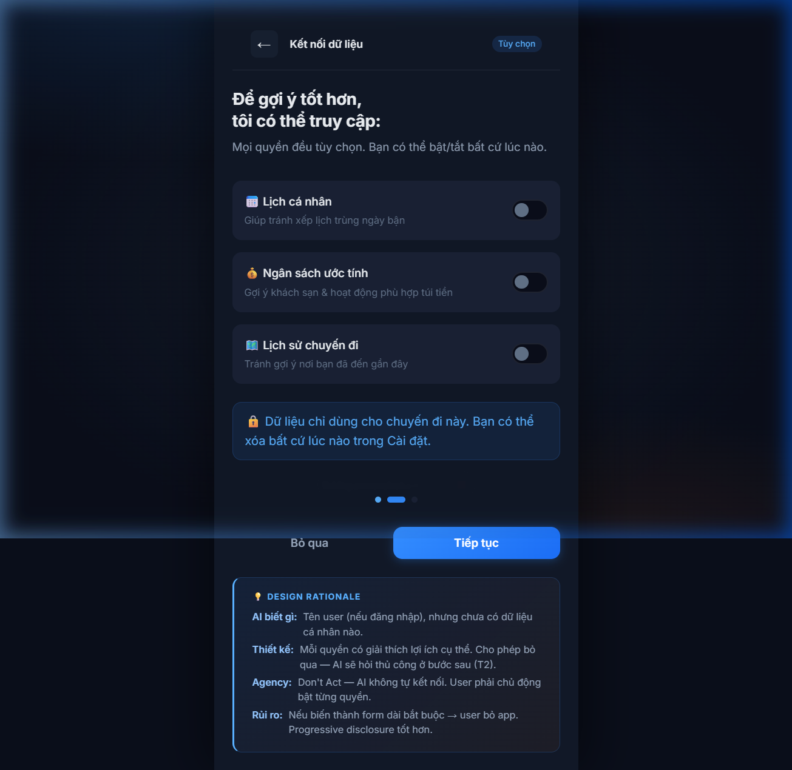
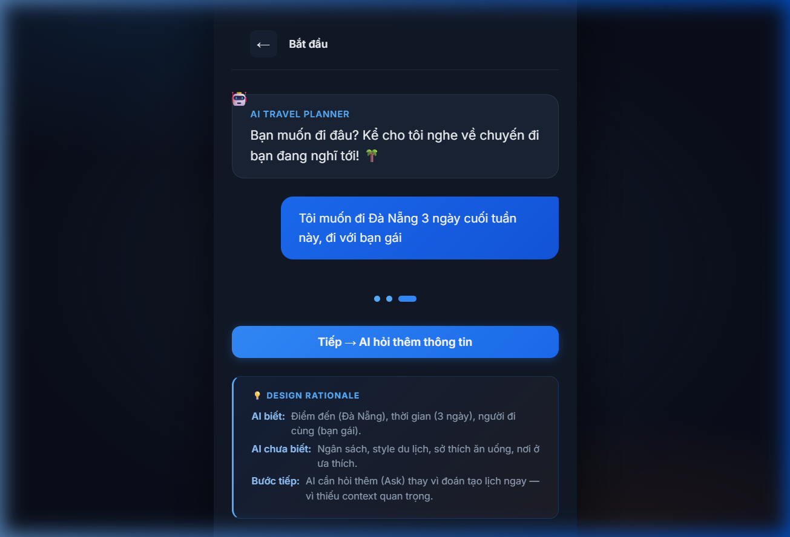
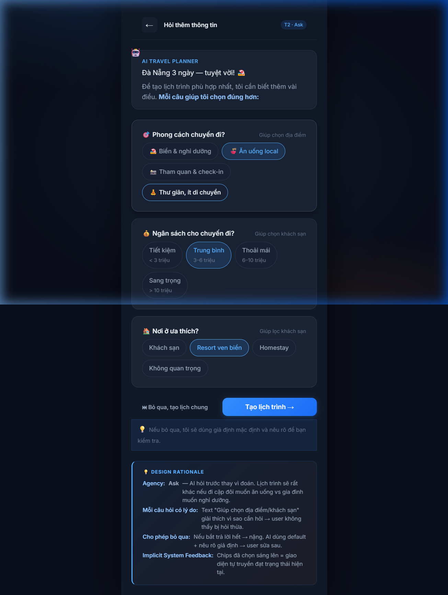
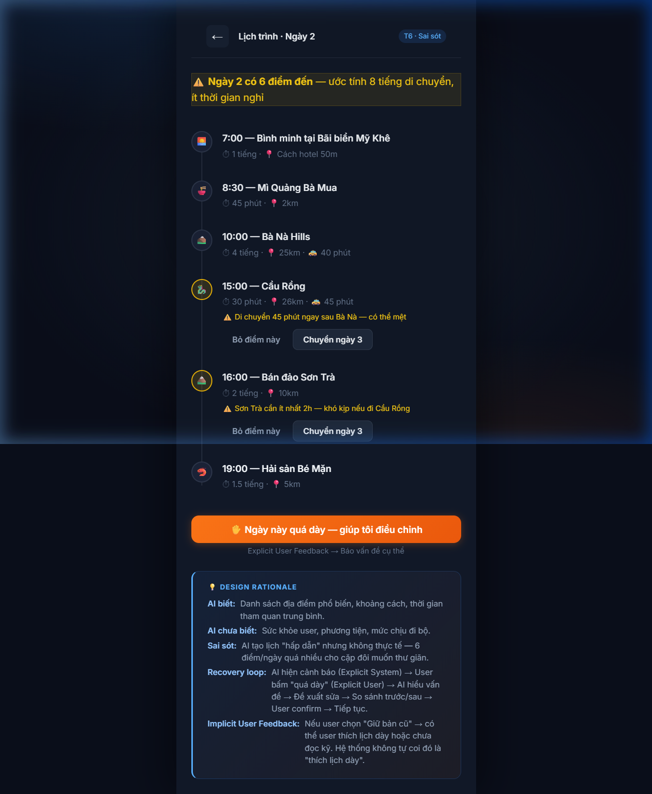
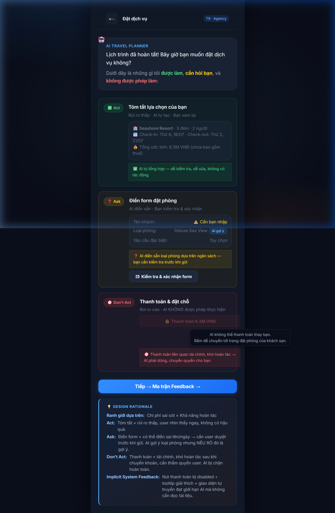
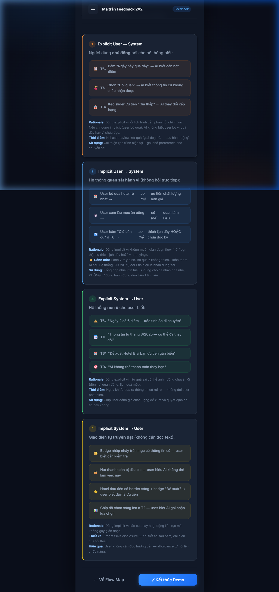

# Walkthrough — AI Travel Planner Prototype

> Hướng dẫn chi tiết từng screen với hình ảnh minh hoạ

---

## 00 — Flow Map

> Tổng quan phạm vi, navigation tới mọi kịch bản


**Mô tả**: Sơ đồ tổng quan nối các kịch bản thành một lát cắt sản phẩm thống nhất. User có thể bấm vào từng node để nhảy tới screen tương ứng, hoặc bấm "Bắt đầu Demo Path" để mở script demo 5 phút trong prototype.

**Phạm vi**: AI tạo & điều chỉnh lịch trình cho chuyến đi Đà Nẵng 3 ngày — phạm vi hẹp nhưng đủ thể hiện vòng đời trải nghiệm AI.

---

## 01 — Onboarding (T0)

### 01a. Welcome — Giới thiệu khả năng & giới hạn


**Mô tả**: Screen đầu tiên user nhìn thấy. Nêu rõ:
- ✅ **CÓ THỂ**: Gợi ý lịch trình, so sánh lựa chọn, điều chỉnh kế hoạch
- ⚠️ **KHÔNG THỂ**: Đặt phòng/thanh toán, đảm bảo giá luôn chính xác, biết sở thích nếu không chia sẻ

**Design Rationale**:
- AI chưa biết gì về user — đây là lần đầu
- Nêu rõ giới hạn ngay từ đầu để tránh user tưởng AI biết hết
- Nếu bỏ qua → user thất vọng khi AI không đặt phòng được

### 01b. Kết nối dữ liệu — Quyền truy cập



**Mô tả**: User chọn chia sẻ dữ liệu nào (lịch, ngân sách, lịch sử chuyến đi). Mỗi toggle có mô tả lợi ích cụ thể.

**Design Rationale**:
- **Agency: Don't Act** — AI không tự kết nối, user phải chủ động bật
- Cho phép bỏ qua hoàn toàn — AI sẽ hỏi thủ công ở bước sau (T2)
- Progressive disclosure tốt hơn form dài bắt buộc

### 01c. Câu hỏi mở đầu



**Mô tả**: AI hỏi câu mở: "Bạn muốn đi đâu?" — User trả lời "Đà Nẵng 3 ngày, đi với bạn gái".

**AI biết sau bước này**: Điểm đến, thời gian, người đi cùng.
**AI chưa biết**: Ngân sách, style du lịch, sở thích ăn uống.

---

## 02 — Hỏi thêm thông tin (T2 · Ask)



**Mô tả**: AI hỏi 3 câu quan trọng nhất (phong cách, ngân sách, nơi ở) trước khi tạo lịch trình. Mỗi câu hỏi có text giải thích vì sao cần hỏi.

**Agency**: **Ask** — AI hỏi thay vì đoán, vì lịch trình sẽ rất khác nếu đi cặp đôi muốn ăn uống vs gia đình muốn nghỉ dưỡng.

**Điểm thiết kế quan trọng**:
- Mỗi câu hỏi có lý do: "Giúp chọn địa điểm", "Giúp chọn khách sạn"
- Nút "Bỏ qua, tạo lịch chung" → AI dùng giả định mặc định + nêu rõ
- **Implicit System Feedback**: Chips đã chọn sáng lên = giao diện tự truyền đạt trạng thái

---

## 03 — So sánh khách sạn (T3 · Explainability)


**Mô tả**: AI đề xuất 3 khách sạn với tiêu chí khác nhau (gần biển / đánh giá cao / giá rẻ). Hiện rõ tiêu chí xếp hạng + cho user kéo slider điều chỉnh.

**Explainability**:
- 3 slider: Gần biển / Đánh giá / Giá thấp
- Khi user kéo slider → danh sách tự sắp xếp lại
- Dòng "Đề xuất vì bạn ưu tiên **gần biển**" = Explicit System Feedback
- Panel "Dữ kiện / Suy luận AI / Trạng thái" phân biệt rating, giá, khoảng cách với suy luận xếp hạng của AI

**Design Rationale**:
- Nếu chỉ đưa 1 hotel → user tưởng là lựa chọn tối ưu duy nhất
- 3 hotel khác nhau giúp user thấy tradeoff
- Cho điều chỉnh tiêu chí = user kiểm soát quyết định

---

## 04 — Lịch trình quá dày + Recovery (T6 · Sai sót & Khôi phục)

### 04a. Phát hiện vấn đề



**Mô tả**: AI tạo lịch trình ngày 2 với 6 điểm đến. Banner cảnh báo: "6 điểm — ước tính 8 tiếng di chuyển". Các mục có vấn đề đánh dấu ⚠️ với lý do cụ thể.

**Explicit System Feedback**: AI tự nêu vấn đề trước — không đợi user phát hiện.

**Dữ kiện vs suy luận**: Timeline hiển thị dữ kiện như địa điểm, khoảng cách, thời lượng; cảnh báo "quá dày" là suy luận AI dựa trên tổng thời gian di chuyển và ít khoảng nghỉ.

### 04b. Recovery loop hoàn chỉnh


**Mô tả**: User bấm "Ngày này quá dày" (Explicit User Feedback) → AI đề xuất sửa cụ thể → So sánh Trước/Sau → User confirm.

**Recovery loop**:
```
AI phát hiện vấn đề (cảnh báo)
        ↓
User xác nhận "quá dày" (Explicit User Feedback)
        ↓
AI hiểu vấn đề cụ thể
        ↓
AI đề xuất sửa (bỏ 2 điểm, thêm giờ nghỉ)
        ↓
So sánh Trước / Sau
        ↓
User chấp nhận hoặc giữ bản cũ
        ↓
AI xác nhận: "Đã cập nhật. Ghi nhớ cho các ngày còn lại."
```

---

## 05 — Thông tin lỗi thời (T7 · Bằng chứng & Explainability)


**Mô tả**: Một mục trong lịch trình có badge 🟡 "Thông tin cũ". Bấm vào hiện:
- **Nguồn**: Google Maps
- **Cập nhật lần cuối**: Tháng 3/2025 (3 tháng trước)
- **Giờ mở cửa**: 6:00–14:00 *(có thể đã thay đổi)*
- **Trạng thái**: ❓ Chưa xác nhận

AI đề xuất 2 quán thay thế với thông tin mới hơn.

**Design Rationale**:
- AI KHÔNG BIẾT thông tin hiện tại có đúng không → phải nói rõ
- Hậu quả: User đến nơi quán đóng → mất thời gian
- **Explicit System Feedback**: Badge 🟡, text "có thể đã thay đổi", link kiểm tra
- **Agency: Don't Act** — AI không tự đổi quán, chỉ user mới quyết

---

## 06 — Đặt dịch vụ (T9 · Agency)



**Mô tả**: 3 mức tự chủ rõ ràng:

| Mức | Hành động | Lý do |
|-----|-----------|-------|
| ✅ **Act** | Tóm tắt lựa chọn | Rủi ro thấp, dễ kiểm tra, không tác động |
| ❓ **Ask** | Điền form đặt phòng (AI điền sẵn, user review) | Có thể sai tên/ngày, cần xác nhận |
| 🚫 **Don't Act** | Thanh toán (nút bị disabled) | Tài chính, khó hoàn tác |

**Ranh giới dựa trên**: Chi phí sai sót × Khả năng hoàn tác

**Implicit System Feedback**: Nút thanh toán bị disabled + tooltip = giao diện tự truyền đạt giới hạn AI.

---

## 05 — Ma trận Feedback 2×2



**Mô tả**: Ma trận 2×2 đầy đủ 4 ô, mỗi ô có ví dụ cụ thể từ flow + rationale đủ 8 câu hỏi bắt buộc.

### Ô 1 — Explicit User → System
- T6: Bấm "Ngày này quá dày"
- T7: Chọn "Đổi quán"
- T3: Kéo slider ưu tiên

### Ô 2 — Implicit User → System
- Bỏ qua hotel rẻ nhất → *có thể* ưu tiên chất lượng
- Xem lâu mục ăn uống → *có thể* quan tâm F&B
- ⚠️ Hành vi ≠ Ý định. Hoàn tác ≠ AI sai.

### Ô 3 — Explicit System → User
- T6: "6 điểm — 8h di chuyển"
- T7: "Thông tin từ tháng 3/2025"
- T9: "AI không thể thanh toán thay bạn"

### Ô 4 — Implicit System → User
- Badge 🟡 nhấp nháy trên thông tin cũ
- Nút disabled + tooltip
- Hotel đầu có border sáng + badge "Đề xuất"

---

## 07 — Demo Path (5 phút)

**Mô tả**: Có màn riêng trong prototype để giảng viên chạy demo theo đúng thứ tự và không bỏ sót nhánh quan trọng.

| Thời gian | Nội dung | Screen |
|-----------|----------|--------|
| 0:00–0:30 | Người dùng, vấn đề, lát cắt | Flow Map |
| 0:30–1:15 | Onboarding + khả năng/giới hạn AI | 01a→01b→01c |
| 1:15–2:15 | Hỏi thêm + So sánh khách sạn (Ask + Explainability) | 02→03 |
| 2:15–3:45 | Lịch quá dày + Thông tin cũ (Sai sót & Recovery) | 04→05 |
| 3:45–4:45 | Đặt dịch vụ (Act/Ask/Don't Act) + Feedback 2×2 | 06→07 |
| 4:45–5:00 | Quyết định thiết kế quan trọng nhất | Tổng kết |
